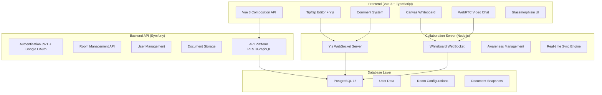

# ?? Synkro – Plateforme Collaborative en Temps Réel
_Documentation technique complète du projet développé avec GitHub Copilot_

Synkro est une **plateforme collaborative avancée** qui combine **édition de texte collaborative, whiteboard partagé, système de commentaires et visioconférence**. Ce projet met l'accent sur la **collaboration temps réel**, l'**expérience utilisateur moderne** avec un design **glassmorphism** et l'architecture **microservices**.

---

## ??? Architecture Technique Complète

### Stack Technologique
- **Frontend** : Vue 3 (Composition API) + TypeScript + TailwindCSS + PrimeVue
- **Backend API** : Symfony 7 + API Platform + Doctrine ORM  
- **Collaboration Server** : Node.js + Yjs + WebSocket  
- **Base de données** : PostgreSQL 16
- **Containerisation** : Docker + Docker Compose  
- **Collaboration** : Yjs (CRDT) + WebSocket Provider

### Architecture Microservices



---

## ?? Évolution du Projet : Itérations Techniques

### Phase 1 : Correction d'Encodage et Harmonisation Design
**Problème identifié** : Caractères corrompus (�) dans les composants Vue
**Solution technique** :
- **Diagnostic** : Corruption UTF-8 dans les fichiers Vue
- **Résolution** : Réécriture complète des composants avec encodage UTF-8 strict
- **Harmonisation** : Implémentation d'un système de design glassmorphism cohérent

**Composants concernés** :
- `WhiteboardCanvas.vue` - Correction encodage + design glassmorphism
- `RoomCall.vue` - Réécriture complète avec WebRTC
- `TipTapEditor.vue` - Refonte avec icônes SVG personnalisées
- `CommentBoard.vue` - Nouveau design modal glassmorphism
- `RoomChat.vue` - Interface chat temps réel

### Phase 2 : Système de Design Glassmorphism
**Implémentation CSS avancée** :
```css
.glass-panel {
  background: rgba(255, 255, 255, 0.1);
  backdrop-filter: blur(10px);
  border: 1px solid rgba(255, 255, 255, 0.2);
  box-shadow: 0 8px 32px rgba(0, 0, 0, 0.1);
}

.btn-glass-primary {
  background: linear-gradient(135deg, rgba(99, 102, 241, 0.8), rgba(168, 85, 247, 0.8));
  backdrop-filter: blur(10px);
  border: 1px solid rgba(255, 255, 255, 0.2);
}
```

**Classes de design créées** :
- `.glass-panel` - Panneaux principaux avec effet verre
- `.btn-glass-*` - Boutons avec variants (primary, secondary, success, warning, danger)
- `.badge-glass-*` - Badges avec transparence
- `.glass-input` - Champs de saisie avec effet verre

### Phase 3 : Architecture Collaborative avec Yjs
**Choix technique Yjs** :
- **CRDT (Conflict-free Replicated Data Types)** pour la résolution automatique des conflits
- **WebSocket Provider** pour la synchronisation temps réel
- **Awareness API** pour la présence utilisateur (curseurs, sélections)

**Serveur Unifié** (`unified-server.js`) :
```javascript
// Serveur Yjs pour la collaboration texte/commentaires
const yjsWss = new WebSocketServer({ server, path: '/yjs' });

// Serveur WebSocket pour le whiteboard
const whiteboardWss = new WebSocketServer({ server, path: '/whiteboard' });

// Gestion des documents Yjs par room
const documents = new Map();
const awarenesses = new Map();

function getDocument(roomname) {
  if (!documents.has(roomname)) {
    const doc = new Y.Doc();
    documents.set(roomname, doc);
    const awareness = new awarenessProtocol.Awareness(doc);
    awarenesses.set(roomname, awareness);
  }
  return documents.get(roomname);
}
```

### Phase 4 : Composables Vue 3 pour la Collaboration
**Architecture Composable** :

#### `useYjsCollaboration.ts` - Base collaborative
```typescript
export function useYjsCollaboration(roomId: string, user: CollaborationUser) {
  const ydoc = new Y.Doc();
  const provider = new WebsocketProvider(wsUrl, roomId, ydoc, {
    connect: true,
    awareness: { user }
  });
  
  // Gestion des événements de connexion
  provider.on('status', (event) => {
    isConnected.value = event.status === 'connected';
  });
  
  return { ydoc, provider, isConnected, collaborators, ... };
}
```

#### `useYjsTipTap.ts` - Éditeur collaboratif
```typescript
export function useYjsTipTap(roomId: string, user: TipTapUser) {
  const editor = new Editor({
    extensions: [
      StarterKit.configure({ history: false }), // Historique géré par Yjs
      Collaboration.configure({
        document: ydoc,
        field: 'tiptap-content',
      }),
      CollaborationCursor.configure({
        provider: provider,
        user: { name: user.name, color: user.color },
      }),
    ],
  });
}
```

#### `useYjsComments.ts` - Système de commentaires
```typescript
export function useYjsComments(roomId: string, user: CommentUser) {
  const yComments = ydoc.getArray('comments');
  
  const addComment = (content: string, type: 'comment' | 'suggestion' | 'question') => {
    const newComment = {
      id: generateId(),
      author: user,
      content,
      timestamp: Date.now(),
      type,
      resolved: false
    };
    yComments.push([newComment]);
  };
}
```

### Phase 5 : Composants Vue Collaboratifs

#### `TipTapEditorYjs.vue` - Éditeur avec collaboration
**Fonctionnalités** :
- Édition collaborative temps réel avec Yjs
- Curseurs collaboratifs avec couleurs utilisateur
- Barre d'outils avec icônes SVG personnalisées
- Indicateur de connexion et liste des collaborateurs
- Formatage : gras, italique, souligné, titres, listes, alignement
- Actions : annuler/rétablir, effacer tout

#### `CommentBoardYjs.vue` - Système de commentaires collaboratif
**Fonctionnalités** :
- Commentaires synchronisés en temps réel
- Types : commentaires, suggestions, questions
- Système de résolution/non-résolu
- Filtres avancés (statut, type, utilisateur)
- Réponses aux commentaires (threading)
- Interface modal glassmorphism

### Phase 6 : Configuration Docker et Déploiement

#### Dockerfile Serveur Unifié
```dockerfile
FROM node:20
WORKDIR /app
COPY package*.json ./
RUN npm install
COPY . .
EXPOSE 3001
CMD ["node", "unified-server.js"]
```

#### Docker Compose Configuration
```yaml
services:
  websocket:
    build: ./server
    container_name: websocket_server
    restart: unless-stopped
    ports:
      - "3001:3001"
    environment:
      - NODE_ENV=production
      - PORT=3001
    networks:
      - synkronet
```

### Phase 7 : Variables d'Environnement et Configuration
```env
# Frontend (.env)
VITE_WS_URL=ws://localhost:3001
VITE_API_URL=http://localhost:8000
VITE_GOOGLE_CLIENT_ID=...

# Production (.env.production)
VITE_WS_URL=ws://localhost:3001
VITE_API_URL=http://localhost:8000
```

---

## ?? Fonctionnalités Techniques Avancées

### 1. **Collaboration Temps Réel (Yjs)**
- **CRDT** : Résolution automatique des conflits d'édition
- **Awareness** : Présence utilisateur avec curseurs colorés
- **Synchronisation** : État partagé entre tous les clients connectés
- **Persistance** : Sauvegarde automatique des documents

### 2. **Architecture WebSocket Duale**
- **Port 3001/yjs** : Collaboration texte et commentaires
- **Port 3001/whiteboard** : Dessin collaboratif et curseurs
- **Gestion des salles** : Isolation par `roomId`
- **Nettoyage automatique** : Suppression des salles vides

### 3. **Interface Utilisateur Glassmorphism**
- **Backdrop-filter** : Effet de flou sur les panneaux
- **Transparence** : Utilisation d'alpha channels (rgba)
- **Gradients** : Dégradés subtils pour les boutons
- **Animations** : Transitions fluides sur les interactions

### 4. **Système de Commentaires Avancé**
- **Types différenciés** : Commentaires, suggestions, questions
- **États** : Résolu/non-résolu avec filtrage
- **Threading** : Réponses aux commentaires
- **Temps réel** : Synchronisation instantanée via Yjs

### 5. **Éditeur Collaboratif (TipTap + Yjs)**
- **Extensions** : StarterKit, Underline, TextAlign, Collaboration
- **Curseurs collaboratifs** : Affichage des positions des autres utilisateurs
- **Historique distribué** : Undo/Redo synchronisé
- **Formatage riche** : Titres, listes, alignement, styles

---

## ?? Déploiement et Tests

### Configuration Docker
La plateforme est entièrement containerisée avec Docker Compose :

**Services déployés** :
- `websocket_server` : Serveur Node.js unifié (Yjs + Whiteboard)
- `vue_frontend` : Application Vue 3 avec Vite
- `symfony_app` : API Symfony avec API Platform
- `postgres_db` : Base de données PostgreSQL 16

### Page de Test Collaboration
`TestCollaboration.vue` - Interface complète de test :
- **Tests de connexion** : Vérification WebSocket Yjs et Whiteboard
- **Monitoring temps réel** : État des connexions et collaborateurs
- **Simulation** : Tests automatisés de collaboration
- **Interface utilisateur** : Design glassmorphism cohérent

### Commandes de Déploiement
```bash
# Construction et démarrage des conteneurs
docker compose up --build -d

# Vérification des logs
docker logs websocket_server

# Tests de connectivité
curl -I http://localhost:5173  # Frontend
curl -I http://localhost:8000  # Backend API
lsof -i :3001                  # WebSocket Server
```

---

## ?? Performances et Optimisations

### Optimisations Yjs
- **Compression** : Utilisation de binary encoding pour les messages
- **Batching** : Regroupement des mises à jour pour réduire le trafic réseau
- **Garbage Collection** : Nettoyage automatique des états obsolètes
- **Persistence** : Sauvegarde périodique des documents

### Optimisations Frontend
- **Lazy Loading** : Chargement à la demande des composants
- **Virtual Scrolling** : Pour les listes de commentaires importantes
- **Debouncing** : Limitation des appels API sur les interactions utilisateur
- **Caching** : Mise en cache des données utilisateur et configuration

### Optimisations WebSocket
- **Connection Pooling** : Réutilisation des connexions
- **Heartbeat** : Ping/Pong pour maintenir les connexions actives
- **Reconnection** : Reconnexion automatique en cas de perte de connexion
- **Room Cleanup** : Suppression automatique des salles vides

---

## ?? Sécurité et Authentification

### Authentification
- **JWT** : Tokens sécurisés pour l'API REST
- **Google OAuth2** : Authentification via Google
- **Session Management** : Gestion des sessions utilisateur
- **CORS** : Configuration sécurisée des origines autorisées

### Validation des Données
- **Input Sanitization** : Nettoyage des données utilisateur
- **Rate Limiting** : Limitation des requêtes par utilisateur
- **Schema Validation** : Validation stricte des données API
- **XSS Protection** : Protection contre les attaques XSS

---

## ?? Métriques et Monitoring

### Monitoring Temps Réel
- **Connexions actives** : Nombre d'utilisateurs par salle
- **Latence WebSocket** : Temps de réponse des messages
- **Taux d'erreur** : Surveillance des erreurs de connexion
- **Usage des ressources** : CPU, mémoire, bande passante

### Analytics Collaboration
- **Sessions collaboratives** : Durée et nombre de participants
- **Actions utilisateur** : Éditions, commentaires, dessins
- **Performance réseau** : Temps de synchronisation
- **Adoption des fonctionnalités** : Usage des différents outils

---

## ?? Roadmap et Améliorations Futures

### Fonctionnalités Planifiées
1. **Persistence avancée** : Sauvegarde automatique en base de données
2. **Permissions granulaires** : Gestion fine des droits par utilisateur
3. **Export/Import** : PDF, Word, Markdown
4. **Templates** : Modèles de documents préconfigurés
5. **Notifications** : Système de notifications push
6. **Mobile** : Application mobile React Native
7. **Plugins** : Architecture extensible pour plugins tiers
8. **Analytics** : Tableau de bord d'usage et statistiques

### Optimisations Techniques
1. **CDN** : Distribution de contenu via CDN
2. **Caching Redis** : Cache distribué pour les sessions
3. **Load Balancing** : Répartition de charge pour les WebSockets
4. **Monitoring** : Intégration Prometheus + Grafana
5. **CI/CD** : Pipeline de déploiement automatisé
6. **Testing** : Tests end-to-end automatisés

---

## ?? Documentation Développeur

### Structure du Projet
```
synkro/
??? frontend/           # Vue 3 + TypeScript
?   ??? src/
?   ?   ??? components/     # Composants réutilisables
?   ?   ??? composables/    # Logique métier Vue 3
?   ?   ??? views/          # Pages de l'application
?   ?   ??? router/         # Configuration des routes
??? backend/            # Symfony + API Platform
?   ??? src/
?   ?   ??? Entity/         # Entités Doctrine
?   ?   ??? Repository/     # Requêtes base de données
?   ?   ??? ApiResource/    # Ressources API Platform
??? server/             # Node.js Collaboration Server
?   ??? unified-server.js   # Serveur Yjs + Whiteboard
?   ??? package.json        # Dépendances Node.js
?   ??? Dockerfile          # Container WebSocket
??? docker-compose.yaml # Orchestration des services
```

### APIs et Endpoints

#### API REST Symfony
- `GET /api/users` - Liste des utilisateurs
- `GET /api/rooms` - Liste des salles
- `POST /api/rooms` - Création d'une salle
- `PUT /api/rooms/{id}` - Modification d'une salle
- `DELETE /api/rooms/{id}` - Suppression d'une salle

#### WebSocket APIs
- `ws://localhost:3001/yjs/{roomId}` - Collaboration Yjs
- `ws://localhost:3001/whiteboard` - Whiteboard collaboratif

### Contribution et Développement
```bash
# Installation des dépendances
cd frontend && npm install
cd backend && composer install
cd server && npm install

# Développement local
docker compose up -d postgres_db
cd frontend && npm run dev
cd backend && symfony serve
cd server && npm run dev

# Tests
cd frontend && npm run test
cd backend && php bin/phpunit
cd server && npm test
```

---

Cette documentation technique retrace l'ensemble du développement de Synkro, depuis la correction des problèmes d'encodage jusqu'à l'implementation complète d'une plateforme collaborative moderne avec Yjs et une architecture microservices robuste.
